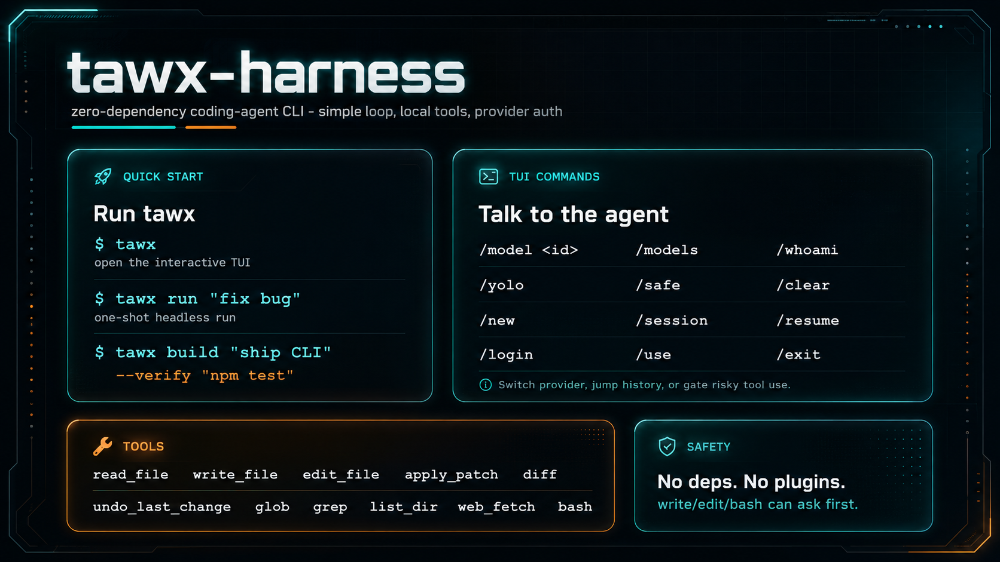

# ▟▙ tawx

A simple coding agent. A model, a short loop, a few local tools — that's it. No Skills, no MCP, no plugins. Zero deps, Node 20+ or Bun.



## Install

```bash
curl -fsSL https://raw.githubusercontent.com/tawgroup/tawx/main/install.sh | bash
```

Installs to `~/.tawx/app`; config and sessions live in `~/.tawx`.

## Setup

```bash
tawx login      # or: tx login — pick provider: opencode / codex / claude
```

## Use

Open the interactive TUI:

```bash
tawx            # or: tx
```

Useful TUI commands:

```text
/model        pick the model — ↑/↓ to choose (or /model <id>)
/effort       how hard the model thinks — none…max (gpt-5.x), or auto
/provider     switch provider (restarts tawx)
/login        add or re-authenticate a provider
/session      show provider, model, tokens & cost
/goal         set a standing goal — tawx keeps working until it's met (/goal clear to stop)
/yolo         auto-approve tool use
/safe         ask before risky tools
/clear        clear conversation
/exit         quit
Ctrl-C        interrupt
```

CLI helpers: `tawx models` · `tawx whoami` · `tawx use` / `tawx login`

## Tools

`read_file` · `write_file` · `edit_file` · `multi_edit` · `diff` · `apply_patch` · `undo_last_change` · `glob` · `grep` · `list_dir` · `web_fetch` · `bash` · `update_plan`

MIT · [tawgroup](https://github.com/tawgroup)
